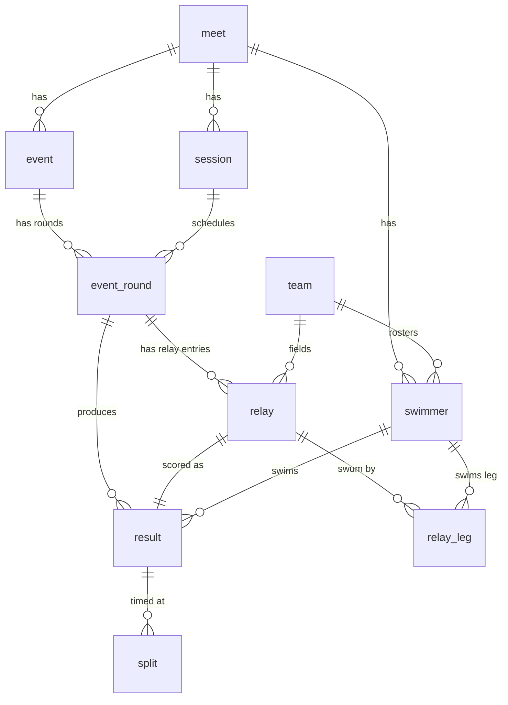

# Swim-Meet Results — Domain Model

A normalized relational model for HY-TEK Meet Manager result pages
(`results/<MEET>/*.htm`). The DDL is in [`../schema.sql`](../schema.sql); the loader
that populates it is [`../parse_meet.js`](../parse_meet.js).

## Why this exists

A scraped meet is ~180 HTML pages, each a fixed-width text table inside a `<pre>`
block — readable, but not queryable. This model turns that into a database where you
can ask "all of a swimmer's swims", "event final order", "team relay splits", or
"fastest 50 Free by age group" with plain SQL.

## Source data, at a glance

- Filenames encode the round: `P###` = Champ **prelims**, `F###` = Champ **finals** or
  an **Open**/relay **timed final**. A Champ event's prelims and finals **share the
  event number** (`P004`/`F004` = Event 4).
- `evtindex.htm` lists **sessions** (`1A`, `1B`, `2`…) with day/time and an ordered set
  of events. A Champ event's prelim and final rounds are listed in *different* sessions,
  so a session attaches to a **round**, not to the event.
- Each event page has a header (facility, report timestamp), an `Event N …` title
  (gender, age group, distance, stroke, division), and result rows.
- **Individual** rows: place, `Last, First`, age, team code, seed/prelim/final times,
  qualifiers (`J`, `DQ`, `NS`). Finals pages group rows into `A/B/C - Final` heats.
- **Relay** rows: place, team + letter, seed/final time, 4 legs (swimmer + age), and
  cumulative/interval splits.

## Entities

| Table | Grain | Notes |
|-------|-------|-------|
| `meet` | one scraped directory | code = dir name (`2025CSA`) |
| `session` | a timed session | ordered by `order_num` |
| `team` | a club | global, keyed by HY-TEK `code`; full name absent in source |
| `swimmer` | a person, per meet | no source ID → identity `(meet, team, last, first)` |
| `event` | a logical event | prelims + finals share one row (`meet`, `event_number`) |
| `event_round` | prelims / finals / timed-final | links `event` ↔ `session` |
| `result` | one performance | individual **or** relay (exactly one FK set) |
| `relay` | a relay-team entry | team + letter within a round |
| `relay_leg` | one of 4 legs | swimmer + age, in swim order |
| `split` | a cumulative split | with the parenthetical interval delta |

### Key modeling decisions

- **Times are centiseconds** (`INTEGER`): `2:19.58` → `13958`. Sorts and compares
  correctly; the original string is kept in the `*_raw` columns for display.
- **Round, not event, owns the session link** — because prelims and finals of one event
  run in different sessions.
- **`result` is a supertype** for individual and relay swims, with
  `CHECK ((swimmer_id IS NOT NULL) <> (relay_id IS NOT NULL))` guaranteeing exactly one.
- **`seed_time` on `result`** stores the left-hand column as displayed (entry seed for
  prelims; the prelim time for a final). The finals page's redundant prelim column and
  its trailing non-qualifier rows are **not** re-inserted — those swimmers already have a
  prelim `result`.
- **Swimmer is per-meet** because age changes between meets and names aren't globally
  unique; `team` is global because its code is stable.

## Entity-relationship diagram



## Data-quality notes (what the loader normalizes, and residual risks)

- **No swimmer IDs.** Identity is `(meet, team, last, first)`. Misspellings in the source
  (e.g. `Valetine` vs `Valentine`) would create distinct swimmers.
- **Relay leg names come in two formats** — `First Last` (most relays) and `Last, First`
  (some). The loader splits on the comma when present, else treats the last token as the
  surname, and canonicalizes `full_name` to `Last, First`. Three-token names
  (`Emma Grey Saunders`) assume a single-word surname.
- **Team codes** carry an LSC suffix parsed into `team.lsc` best-effort: `BUR-NC` → `NC`;
  `FR`/`PT` have none (`NULL`); `EL-NC-NC` keeps the trailing `NC`.
- **Ties** are preserved — `place` is not unique within a round (two swimmers can share
  place `11`). `DQ`/`NS` rows have `place = NULL`.
- **Qualifiers** are split from the time: `J40.24` → `time_cs`=40.24s, `time_code='J'`;
  `DQ 48.60` → time kept with `time_code='DQ'`; bare `DQ`/`NS` → `time_cs=NULL`.
- **Non-results pages are skipped.** A mid-meet scrape can contain HY-TEK *Psych Sheets*
  (pre-meet seedings, full team names, no places) and "results not available"
  placeholders; the loader detects and skips these. A directory with zero results loads
  nothing. (`results/2026CSA` is such a mid-meet snapshot — only completed events load.)
- **Assumption:** a result row's first time cell is the seed and the second is the swum
  time. Rows with a blank seed but a present time (rare deck entries) would be
  misattributed; none occur in the current data.

## Sample queries

```sql
-- One swimmer's full schedule (individual swims), fastest first.
SELECT e.event_number, e.title, er.round_type, r.place, r.time_raw
FROM result r
JOIN event_round er ON er.round_id = r.round_id
JOIN event e        ON e.event_id  = er.event_id
JOIN swimmer s      ON s.swimmer_id = r.swimmer_id
WHERE s.full_name = 'Xie, George'
ORDER BY r.time_cs;

-- Final results of an event, in order (A/B/C finals then place).
SELECT r.heat_group, r.place, s.full_name, t.code, r.time_raw
FROM result r
JOIN event_round er ON er.round_id = r.round_id
JOIN event e        ON e.event_id  = er.event_id
JOIN swimmer s      ON s.swimmer_id = r.swimmer_id
JOIN team t         ON t.team_id    = s.team_id
WHERE e.event_number = 4 AND er.round_type = 'FINAL'
ORDER BY r.place;

-- A relay entry with its legs and splits.
SELECT rl.relay_letter, l.leg_no, l.swimmer_name_raw, sp.split_no,
       sp.cumulative_time_cs, sp.interval_time_cs
FROM relay rl
JOIN result r    ON r.relay_id = rl.relay_id
JOIN relay_leg l ON l.relay_id = rl.relay_id
LEFT JOIN split sp ON sp.result_id = r.result_id
JOIN event_round er ON er.round_id = rl.round_id
JOIN event e        ON e.event_id  = er.event_id
WHERE e.event_number = 33 AND rl.relay_letter = 'A'
ORDER BY l.leg_no, sp.split_no;

-- Fastest individual 50 Free winners across age groups.
SELECT e.gender, e.age_group_label, s.full_name, t.code, r.time_raw
FROM result r
JOIN event_round er ON er.round_id = r.round_id
JOIN event e        ON e.event_id  = er.event_id
JOIN swimmer s      ON s.swimmer_id = r.swimmer_id
JOIN team t         ON t.team_id    = s.team_id
WHERE e.stroke = 'FREE' AND e.distance = 50 AND e.is_relay = 0
  AND er.round_type = 'FINAL' AND r.place = 1
ORDER BY r.time_cs;
```

## Loading

```
node parse_meet.js results/2025CSA meets.db
```

Requires Node ≥ 22.5 (built-in `node:sqlite`; no npm dependencies). Re-running is
idempotent — the meet's rows are deleted (FK cascade) and reloaded — and multiple meets
can share one database file.
